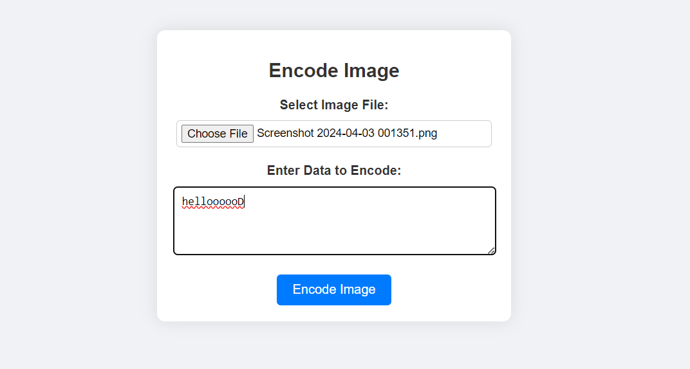
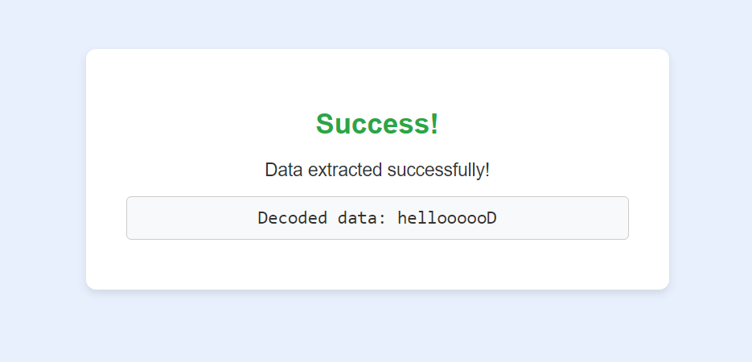

# Image-Steganography: 

## Overview
This project focuses on the practice of image steganography, a method of hiding secret messages within an image file. It leverages Python to encode and decode messages securely without altering the appearance of the image to the naked eye.

## Features
- Encoding: Hide secret messages within images using least significant bit (LSB) manipulation.

- Decoding: Extract hidden messages from steganographic images.
- Support for Various Image Formats: Works with popular image formats like PNG.
- User-Friendly Interface: Simple command-line interface for easy encoding and decoding.
  

## Technology Stack
- Language: Python
- Libraries: PIL (Python Imaging Library), NumPy, OpenCV
- Topics: Steganography, Cyber Security, Image Processing
## Examples

### Encoded Image

### Decoded Image

